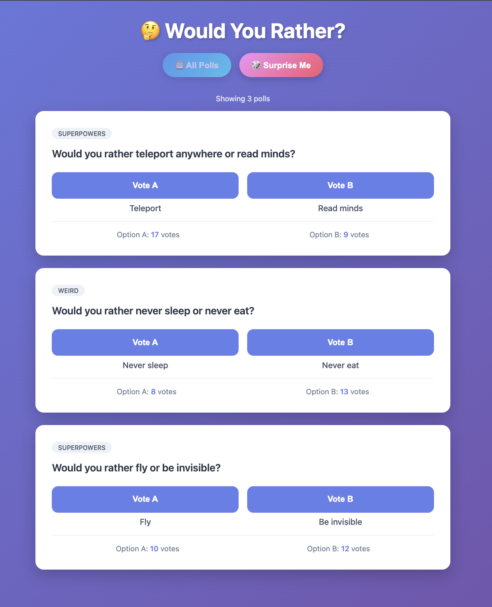
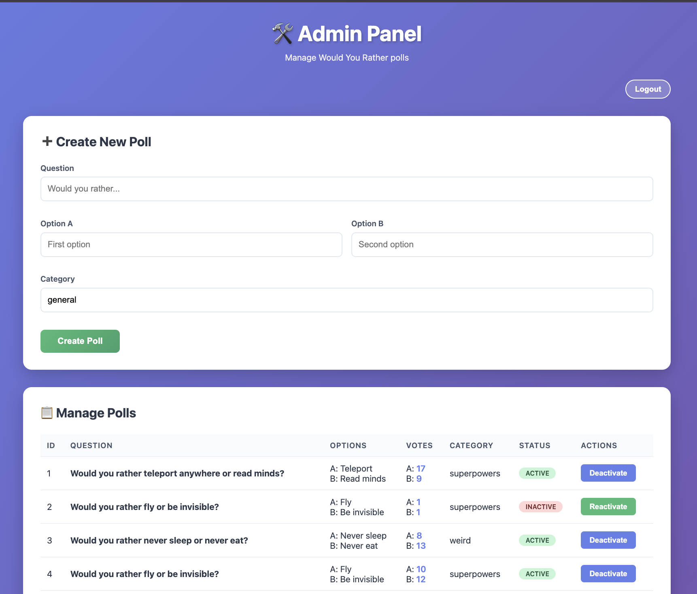

# Would You Rather? 🔴 🔵

A full-stack interactive polling application built with **FastAPI** and **Vanilla JavaScript**. Features public voting, secure admin dashboard, and RESTful API.

**Live Demo:** _Coming soon_  
**API Docs (local):** `http://127.0.0.1:8000/docs`

---

## 📸 Screenshots

### Public Voting Interface
*Real-time voting with instant feedback*



### Admin Dashboard
*Token-protected content management*



---

## 🚀 Quick Start

### Features
**Public Interface** (`/play`):
- Browse and vote on active polls
- Real-time vote count updates
- Mobile-responsive design

**Admin Dashboard** (`/admin`):
- Token-based authentication
- Create, activate, and deactivate polls
- View all polls including inactive ones

### Installation
```bash
# Clone and navigate
git clone https://github.com/romansally/would-you-rather.git
cd would-you-rather

# Set up backend
cd backend
python -m venv ../venv
source ../venv/bin/activate  # Windows: ..\venv\Scripts\activate
pip install -r requirements.txt
```

**Configure environment:** Create `backend/.env`:
```env
ADMIN_TOKEN=your-secret-token-here
```

**Generate secure token:**
```bash
python3 -c "import secrets; print(secrets.token_urlsafe(32))"
```

**Run server:**
```bash
# From backend/ directory
python -m uvicorn app:app --reload
```

**Access Points:**
- Public UI: http://127.0.0.1:8000/play
- Admin UI: http://127.0.0.1:8000/admin
- API Docs: http://127.0.0.1:8000/docs

---

## 🛠️ Tech Stack

- **Backend:** Python 3.x, FastAPI, Uvicorn
- **Database:** SQLite with SQLModel ORM
- **Frontend:** HTML5, CSS3, Vanilla JavaScript (ES6+)
- **Architecture:** REST API with client-server separation

---

<details>
<summary><b>📖 Technical Decisions & Learning Outcomes</b></summary>

### Architecture Choices

**Why FastAPI?**
- Native async support for concurrent requests
- Automatic OpenAPI documentation
- Type safety with Pydantic validation

**Why Vanilla JavaScript?**
- Demonstrates core DOM manipulation and Fetch API fundamentals
- Zero build tools required (maximum portability)
- Proves understanding of concepts typically abstracted by frameworks

**Why SQLModel?**
- Combines SQLAlchemy ORM with Pydantic validation
- Single source of truth for database schema and API models
- Type hints throughout the data layer

### Key Learning Moments

1. **Fail-Closed Security Pattern**
   - Admin endpoints require `X-Admin-Token` header
   - Missing or invalid tokens return 401/403 (unauthorized)
   - Server requires `ADMIN_TOKEN` environment variable to be configured
   - Design principle: prefer explicit errors over silent failures

2. **Idempotent Operations**
   - PATCH endpoints (`/deactivate`, `/reactivate`) check current state before modifying
   - If poll is already in desired state, return immediately without database write
   - Makes endpoints safe for retries and prevents unnecessary operations

3. **Code Maintainability**
   - Successfully returned to codebase after 1-2 month gaps between development phases
   - Modular architecture and clear naming conventions enabled immediate feature additions
   - Proves code was self-documenting and professionally structured

### Development Timeline

- **Phase 1 (Sept 2025):** Foundation & database design
- **Phase 2 (Nov 2025):** Core features & voting logic
- **Phase 3 (Dec 2025):** Security hardening & admin dashboard

**Total:** 3 months calendar time, approximately 30 hours of focused development (~8 hours Phase 1, ~10 hours Phase 2, ~12 hours Phase 3)

### What I'd Do Differently

- Add structured logging middleware for request/response tracking
- Implement database migrations with Alembic
- Use environment-specific configuration (dev/staging/prod)
- Add rate limiting to prevent vote manipulation

</details>

---

<details>
<summary><b>🔒 Security Implementation</b></summary>

### Authentication
- Header-based authentication using `X-Admin-Token` custom header
- Admin endpoints reject requests without valid token (401/403)
- Token stored in `sessionStorage` (clears on browser close)

### Input Sanitization
- Implements `escapeHtml()` function in frontend to sanitize user-provided strings before DOM insertion
- Prevents common XSS vectors in admin-created content

### Data Isolation
- Public endpoints filter for `is_active=True` in database queries
- Soft-deleted polls remain in database but are hidden from public API
- Admin endpoints use separate route (`/admin/list`) with authentication requirement

</details>

---

<details>
<summary><b>🔌 API Documentation</b></summary>

Interactive API documentation available at `/docs` (Swagger UI).

### Public Endpoints
*(Verified against `/docs`)*

| Method | Endpoint | Description |
|--------|----------|-------------|
| GET | `/polls/` | List all active polls |
| GET | `/polls/{poll_id}` | Get single active poll |
| GET | `/polls/random` | Get random active poll |
| POST | `/polls/{poll_id}/vote` | Cast vote (body: `{"choice": "a" or "b"}`) |

### Admin Endpoints
*Require `X-Admin-Token` header*

| Method | Endpoint | Description |
|--------|----------|-------------|
| POST | `/polls/` | Create new poll |
| GET | `/polls/admin/list` | List all polls (including inactive) |
| PATCH | `/polls/{poll_id}/deactivate` | Soft-delete poll (idempotent) |
| PATCH | `/polls/{poll_id}/reactivate` | Restore poll (idempotent) |

</details>

---

## 🚀 Deployment Status

**Current:** Optimized for local development and demonstration.

**Deployment-Ready Features:**
- ✅ Environment variable configuration (`.env` pattern with python-dotenv)
- ✅ Pinned dependencies in `requirements.txt`
- ✅ Static file serving configured
- ✅ Token-based authentication implemented

### Important: SQLite on Cloud Hosting

This application uses SQLite for simplicity. When deployed to free-tier cloud platforms (Render, Railway, Fly.io), the database will be **ephemeral** (data resets on service restart due to non-persistent filesystems).

**This is acceptable for portfolio demonstrations.** For production deployments requiring data persistence, migrate to PostgreSQL or attach persistent storage.

**Next Deployment Steps:**
1. Deploy to Render/Railway with ephemeral SQLite (fastest path)
2. Configure `ADMIN_TOKEN` in platform environment variables
3. Test public voting and admin authentication
4. Update this README with live URL

---

<details>
<summary><b>✅ Future Enhancements</b></summary>

- [ ] Vote analytics dashboard with percentage breakdowns
- [ ] Poll category filtering in public UI
- [ ] Rate limiting middleware (prevent vote spam)
- [ ] Database migrations with Alembic
- [ ] PostgreSQL support for production persistence
- [ ] Poll scheduling (auto-activate at future date)

</details>

---

## 📝 License

MIT License — see [LICENSE](LICENSE) file.

---

*Built by Roman Sally | [GitHub](https://github.com/romansally) | December 2025*